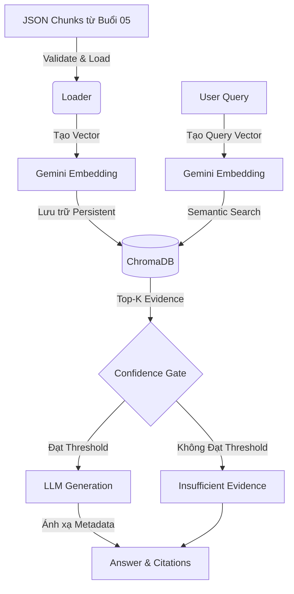

# RAG Foundation - Buổi 07 (Hoàn thiện Hệ thống)

## 1. Mục tiêu
Dự án này là phiên bản hoàn chỉnh của một pipeline Retrieval-Augmented Generation (RAG) cơ bản, kết nối các thành phần từ xử lý dữ liệu, vector hóa, tìm kiếm ngữ nghĩa, đến sinh câu trả lời bằng LLM. Mục đích là cung cấp một hệ thống hỏi đáp dựa trên tài liệu ngân hàng một cách có căn cứ, hạn chế tối đa ảo giác (hallucination) nhờ cơ chế kiểm soát chất lượng bằng Confidence Gate và Citation.

## 2. Quan hệ với Buổi 05 và Buổi 06
- **Buổi 05 (Xử lý dữ liệu)**: Cung cấp đầu vào là các file JSON chứa nội dung đã được làm sạch và chunking từ các tài liệu PDF gốc (như luật, quy định, cẩm nang). Buổi 07 tái sử dụng môi trường ảo (`.venv`) của Buổi 05 và đọc trực tiếp từ thư mục `output/chunks/`.
- **Buổi 06 (PoC)**: Đã chứng minh tính khả thi của việc nhúng vector và tra cứu bằng ChromaDB. Buổi 07 đưa PoC này thành một ứng dụng hoàn thiện hơn với CLI, UI (Streamlit), và hệ thống Test toàn diện.

## 3. Sơ đồ Pipeline


## 4. Cấu trúc thư mục
```
buoi_07/
├── .env.example       # Template biến môi trường
├── .env               # Chứa cấu hình và API Key thật (không commit)
├── .gitignore         # Chặn lưu storage, .env, __pycache__
├── app.py             # Giao diện UI viết bằng Streamlit
├── rag.py             # Core logic RAG (CLI, Loader, Embedding, Chroma, Retrieval)
├── requirements.txt   # Thư viện cần thiết
├── README.md          # Tài liệu dự án
├── storage/           # Thư mục lưu dữ liệu ChromaDB (tạo tự động)
└── tests/             # Bộ Unit Test kiểm tra độ chính xác của hệ thống
```

## 5. Điều kiện đầu vào
- Đã hoàn thành Buổi 05 và có sẵn dữ liệu chuẩn trong thư mục `rag_foundation/buoi_05/output/chunks/`.
- Có API Key của Gemini.
- Python 3.10 trở lên.

## 6. Cách dùng `.venv` Buổi 05
Hệ thống Buổi 07 dùng chung môi trường ảo của Buổi 05 để tiết kiệm dung lượng.
**Kích hoạt (Windows PowerShell):**
```powershell
..\buoi_05\.venv\Scripts\activate
```
**Kích hoạt (macOS/Linux):**
```bash
source ../buoi_05/.venv/bin/activate
```

## 7. Cách cài requirements
Sau khi kích hoạt `.venv`:
```bash
pip install -r requirements.txt
```

## 8. Cách tạo `.env` từ `.env.example`
Sao chép template để tạo file cấu hình thật:
```bash
cp .env.example .env
```
Mở file `.env` và điền `GEMINI_API_KEY` của bạn.

## 9. Giải thích từng biến môi trường
- `GEMINI_API_KEY`: Khóa xác thực để gọi Gemini API.
- `GEMINI_EMBEDDING_MODEL`: Mô hình nhúng (ví dụ: `text-embedding-004`).
- `GEMINI_EMBEDDING_DIM`: Số chiều vector (128 đến 3072). Vector càng lớn càng chi tiết nhưng tốn dung lượng.
- `GEMINI_GENERATION_MODEL`: Mô hình sinh câu trả lời (ví dụ: `gemini-1.5-flash`).
- `DEFAULT_TOP_K`: Số lượng evidence tối đa lấy ra để đưa vào context (1 đến 20).
- `RAG_MAX_DISTANCE`: Ngưỡng khoảng cách tối đa (cosine distance). Nếu evidence có khoảng cách lớn hơn ngưỡng này, nó sẽ bị loại bỏ (ví dụ: `0.45`).

---

## 10. Lệnh validate
Kiểm tra tính hợp lệ của dữ liệu JSON đầu vào:
```bash
python rag.py validate --strategy hierarchical
```

## 11. Lệnh status
Kiểm tra trạng thái cấu hình và database:
```bash
python rag.py status --strategy hierarchical
```

## 12. Lệnh index
Nhúng và lưu dữ liệu vào ChromaDB:
```bash
python rag.py index --strategy hierarchical
```

## 13. Lệnh reset đúng collection
Xóa collection cũ và index lại từ đầu:
```bash
python rag.py index --strategy hierarchical --reset
```

## 14. Lệnh query CLI
Truy vấn trực tiếp trên terminal:
```bash
python rag.py query --strategy hierarchical --top-k 5 --question "Câu hỏi của bạn?"
```

## 15. Lệnh chạy test
Kiểm thử toàn bộ hệ thống tự động:
```bash
python -m unittest discover -s tests -v
```

## 16. Lệnh chạy Streamlit
Khởi chạy giao diện web:
```bash
python -m streamlit run app.py
```

## 17. Giải thích thuật ngữ
- **strategy**: Phương pháp cắt (chunking strategy) dữ liệu (fixed-size, semantic, hierarchical).
- **embedding model**: AI chuyển đổi chữ viết thành các con số toán học (vector).
- **embedding dimension**: Số lượng đặc trưng (con số) mô tả một chunk.
- **collection identity**: ChromaDB phân biệt các bảng dữ liệu bằng tên. Nếu thay đổi model/dim, ứng dụng tự tạo collection mới không ghi đè collection cũ.
- **top-k**: Tìm ra tối đa K chunks giống câu hỏi nhất.
- **cosine distance**: Thước đo khoảng cách giữa 2 vector. Số càng nhỏ càng sát nghĩa. (1 - cosine similarity).
- **RAG_MAX_DISTANCE**: Ngưỡng chốt chặn. Nếu chunk có distance quá cao, ứng dụng cho rằng nó chả liên quan gì đến câu hỏi.
- **confidence gate**: "Cổng" rà soát. Nó dựa vào `RAG_MAX_DISTANCE` để lọc rác.
- **retrieval-only**: Trạng thái "Chỉ tra cứu". Nếu LLM sinh lỗi, ứng dụng vẫn trả về các bằng chứng tìm được mà không cần tổng hợp.
- **citation**: Ánh xạ từ các thẻ trích dẫn do LLM sinh (vd: `[E1]`) sang thông tin thực tế lưu trong metadata (tên file, số trang, chunk id) để ngừa ảo giác.

## 18. Cách dừng Streamlit
Mở terminal đang chạy Streamlit, nhấn `Ctrl+C` để dừng máy chủ.

## 19. Troubleshooting
- **thiếu package**: Bạn quên chạy `pip install -r requirements.txt`.
- **sai interpreter**: Bạn chưa kích hoạt `.venv` của Buổi 05.
- **thiếu API key**: Bạn chưa tạo file `.env` hoặc chưa điền key.
- **collection rỗng**: Bạn chưa chạy lệnh `index`.
- **model/dimension mismatch**: Bạn đã đổi thông số trong `.env` sau khi index. Hãy chạy `index --reset` để tạo lại collection.
- **JSON lỗi**: Dữ liệu Buổi 05 có thể bị hỏng. Chạy `validate` để xem chi tiết lỗi.
- **embedding lỗi/rate limit**: Google API chặn vì gọi quá nhiều. Chờ 1 phút hoặc tạo API Key mới.

## 20. Giới hạn của demo
- Chỉ hỗ trợ vector search đơn giản (không có Hybrid Search hay Reranker).
- Cập nhật dữ liệu cần reset và tạo lại toàn bộ collection nếu thay đổi file.
- Không có phân quyền (RBAC) và chưa sẵn sàng để deploy public.

## 21. Cảnh báo
> [!CAUTION]
> 1. **Không phải tư vấn pháp lý**: Kết quả từ ứng dụng này không thay thế cho chuyên gia pháp lý hay quy định gốc ban hành bởi Nhà nước/Ngân hàng.
> 2. **Threshold cần hiệu chỉnh**: `RAG_MAX_DISTANCE` hiện tại là tham số cứng, bạn cần thử nghiệm với dữ liệu thực tế để tìm điểm cân bằng giữa "ảo giác" và "thiếu thông tin".
> 3. **Retrieval có thể bỏ sót thông tin**: Chunking không phản ánh 100% ngữ cảnh toàn cục của văn bản dài.
> 4. **Bảo mật dữ liệu**: Nội dung các chunk được gửi trực tiếp qua Internet đến máy chủ của Google để tạo Embedding và Generation. Tuyệt đối **không đưa dữ liệu mật, thông tin khách hàng nhạy cảm** vào hệ thống nếu không được phép!

---

## Phần Test Thủ Công (Manual Test Plan)

A. Có khả năng thuộc tài liệu:
`python rag.py query --strategy hierarchical --question "Cơ cấu lại thời hạn trả nợ được quy định như thế nào?"`

B. Có khả năng thuộc tài liệu:
`python rag.py query --strategy hierarchical --question "Việc phân loại nợ và trích lập dự phòng được thực hiện như thế nào?"`

C. Ngoài phạm vi:
`python rag.py query --strategy hierarchical --question "Ngân hàng nào có lãi suất tiết kiệm cao nhất hôm nay?"`
Kỳ vọng mong muốn cho C: 
- Ứng dụng trả về `Không tìm thấy đủ thông tin liên quan trong tài liệu đã cung cấp.` do evidence bị chặn bởi threshold, LLM generation không được kích hoạt. Không bịa đặt tên ngân hàng. (Lưu ý: đây là kỳ vọng, cần hiệu chỉnh RAG_MAX_DISTANCE thực tế nếu xảy ra false positive).
