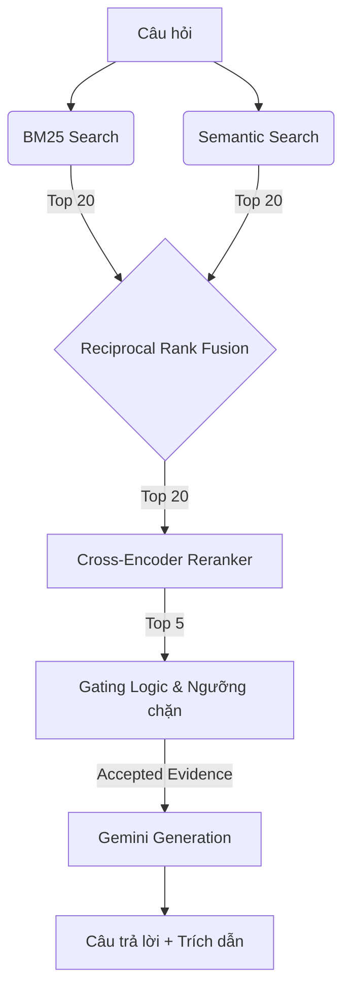

# Khoá Học: Advanced RAG System

Dự án này là phiên bản mở rộng (Buổi 08) của hệ thống RAG cơ bản (Buổi 07), được thiết kế để giải quyết bài toán truy xuất văn bản pháp lý chuyên sâu bằng kiến trúc đa tầng (Multi-stage Retrieval).

## 1. Mục Tiêu & Sự Khác Biệt (Buổi 07 vs Buổi 08)
- **Buổi 07 (Basic RAG):** Chỉ sử dụng Vector Search (Cosine distance) đơn thuần. Dễ bị miss từ khoá chính xác (Exact match) như số "Điều 7", "Khoản 2", và dễ sinh ảo giác nếu không có ngưỡng cắt (distance threshold).
- **Buổi 08 (Advanced RAG):** Nâng cấp toàn diện với 3 tầng truy xuất:
  1. **Lexical (BM25):** Vớt lại sức mạnh tìm kiếm từ khoá chính xác, bảo toàn số Điều/Khoản và tiếng Việt có dấu.
  2. **Fusion (RRF):** Trộn kết quả từ BM25 và Vector Search bằng Reciprocal Rank Fusion, tận dụng ưu điểm của cả hai.
  3. **Reranker (Cross-Encoder):** Đánh giá lại cặp `(Câu hỏi, Văn bản)` để sắp xếp lại top ứng viên cuối cùng bằng mô hình Deep Learning chuyên dụng, tăng độ chính xác (Precision) lên tối đa trước khi đưa vào LLM.

## 2. Sơ Đồ Pipeline (Data Flow)


## 3. Cấu Trúc Dự Án
- `rag.py`: File nền tảng từ Buổi 07 (Loading chunks, Vector db, Gemini API).
- `advanced_rag.py`: Não bộ của Buổi 08 (BM25, RRF, Reranker, Gating).
- `evaluate.py`: Công cụ đo lường tự động (Recall, MRR, nDCG).
- `app.py`: Giao diện Streamlit cho phép nhìn thấu dữ liệu qua các tabs.
- `tests/`: Bộ Unit Test kiểm chứng 30 kịch bản ngặt nghèo hoàn toàn offline.

## 4. Cài Đặt & Môi Trường
1. Khởi tạo môi trường ảo:
   ```bash
   python -m venv .venv
   .venv\Scripts\activate
   ```
2. Cài đặt thư viện:
   ```bash
   pip install -r requirements.txt
   ```
3. Copy và điền API Key:
   ```bash
   cp .env.example .env
   # Điền GEMINI_API_KEY vào .env
   ```

## 5. Cảnh Báo Tài Nguyên Reranker
- Mô hình `BAAI/bge-reranker-v2-m3` có dung lượng ~2.2GB.
- Khi gọi lệnh Rerank lần đầu, hệ thống sẽ **tự động tải mô hình** về thư mục `storage/huggingface/`.
- Quá trình này cần kết nối mạng tốt. Nếu chạy trên CPU (không có GPU CUDA), thời gian chấm điểm (Inference) cho 20 candidates sẽ mất khoảng vài giây tùy máy.

## 6. Danh Sách Lệnh CLI
- **Xem Status:** `python advanced_rag.py status --strategy hierarchical`
- **Tạo Vector DB (Semantic):** `python advanced_rag.py prepare-semantic --strategy hierarchical`
- **Truy vấn BM25:** `python advanced_rag.py bm25 --strategy hierarchical --question "..."`
- **Truy vấn Hybrid (RRF):** `python advanced_rag.py hybrid --strategy hierarchical --question "..."`
- **Truy vấn Rerank:** `python advanced_rag.py rerank --strategy hierarchical --question "..."`
- **Hỏi đáp sinh câu trả lời (Mặc định Hybrid_Rerank):** `python advanced_rag.py query --strategy hierarchical --question "..."`
- **So sánh 4 thuật toán cùng lúc:** `python advanced_rag.py compare --strategy hierarchical --question "..."`

## 7. Đánh Giá & Giao Diện
- **Chạy Test:** `python -m unittest discover -s tests -p "test_*.py" -v`
- **Đánh giá Metrics (Offline):** `python evaluate.py --strategy hierarchical --k 5`
- **Mở Giao diện Web:** `python -m streamlit run app.py`

## 8. Giải Thích Các Loại Điểm Số (Scores)
- **BM25 Score:** Tính theo thuật toán phân phối từ vựng. **Càng cao càng tốt**.
- **Cosine Distance:** Khoảng cách không gian Vector. **Càng thấp (tiến về 0) càng tốt**.
- **RRF Score:** Điểm tính theo công thức Rank nhịch đảo `1 / (k + rank)`. **Càng cao càng tốt**.
- **Rerank Score:** Điểm xuất ra từ Cross-Encoder đã được chuẩn hoá Sigmoid về khoảng (0, 1). **Càng cao càng tốt**. *Lưu ý: Đây không phải là xác suất (Probability) tuyệt đối.*

## 9. Khái Niệm Candidate K và Final K
- **Candidate K (BM25/Semantic):** Số lượng ứng viên được bốc lên ở giai đoạn 1 (Ví dụ: 20). Quá trình gộp Union sẽ có thể tạo ra từ 20 đến 40 chunks.
- **Rerank Candidates:** Số lượng chunks tối đa đẩy vào cho AI đọc và chấm điểm (giới hạn để tránh cháy RAM/Trễ cao, ví dụ: 20).
- **Final Top K:** Số lượng evidence tinh hoa nhất (Ví dụ: 5) được qua Gating để đẩy vào System Prompt cho Gemini sinh text.

## 10. Evaluation Metrics & Hạn Chế
- **Recall@K:** Tỉ lệ tài liệu vàng tìm thấy / Tổng số tài liệu vàng.
- **MRR@K (Mean Reciprocal Rank):** Tập trung vào vị trí của tài liệu vàng ĐẦU TIÊN. Càng gần Top 1 điểm càng cao.
- **nDCG@K:** Đo lường chất lượng xếp hạng dựa trên sự suy giảm theo thứ bậc (Logarithmic discount).
- **Giới Hạn:** Nếu file test json có cờ `needs_human_review=true`, nghĩa là Ground Truth sinh ra bằng máy có thể sai lệch, các chỉ số chỉ dùng để tham khảo.

## 11. Xử Lý Sự Cố (Troubleshooting)
- **Thiếu API Key:** Lỗi "Thiếu GEMINI_API_KEY". Hãy kiểm tra lại file `.env`.
- **Reranker unavailable:** Thường do mất Internet lúc tải model hoặc thiếu RAM/CUDA. Bạn có thể ép chế độ `RERANK_DEVICE=cpu` trong `.env`.
- **Collection không tồn tại:** Chạy lệnh `prepare-semantic` để index Chroma trước khi query.

## 12. Miễn Trừ Trách Nhiệm
> Dự án này chỉ phục vụ mục đích nghiên cứu và giáo dục kiến trúc phần mềm (Software Engineering). AI có thể sinh ảo giác (Hallucination). Mọi kết quả vấn đáp không có giá trị thay thế cho việc tư vấn pháp lý từ luật sư chuyên nghiệp.

---
## Phụ lục: Các Câu Hỏi So Sánh Khuyên Dùng (Manual Check)
Bạn hãy nhập các câu này vào Tab "So Sánh Retrieval" trên Streamlit để thấy rõ sự thay đổi (Rank Movement):
- **A. Exact legal reference:** `Điều 7 quy định như thế nào về cơ cấu lại thời hạn trả nợ?` (Kỳ vọng: BM25 xuất sắc bắt được "Điều 7").
- **B. Paraphrase semantic:** `Khách hàng gặp khó khăn có thể được điều chỉnh kỳ hạn trả nợ ra sao?` (Kỳ vọng: Semantic bắt được ý định dù khác từ vựng).
- **C. Multi-concept:** `Phân loại nợ và trích lập dự phòng được thực hiện như thế nào?` (Kỳ vọng: Hybrid gom đủ các nhánh).
- **D. Out-of-scope:** `Ngân hàng nào có lãi suất tiết kiệm cao nhất hôm nay?` (Kỳ vọng: Toàn bộ bị Block bởi Gating threshold, không sinh ảo giác).
